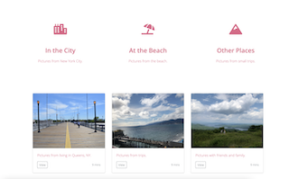

# My Images Site
>A site to display my pictures. 

## General Information
This is a personal project. The purpose of this project is to apply what I have learned about HTML and CSS; in addition,
I am making it personal by adding pictures I have taken during trips. This will be a fun project!

## Screenshots

## Technologies
* HTML5
* CSS3
* Bootstrap 4

## Status
This project is in progress. Pictures will be added. 

To-do list:
* Develop the site such as adding tabs and pictures.

## Inspiration
Project was inspired by The App Brewery's "The Complete Web Development Bootcamp", specifically the TinDog project.

## Contact
Created by me. Please let me know if you have any questions or comments.
